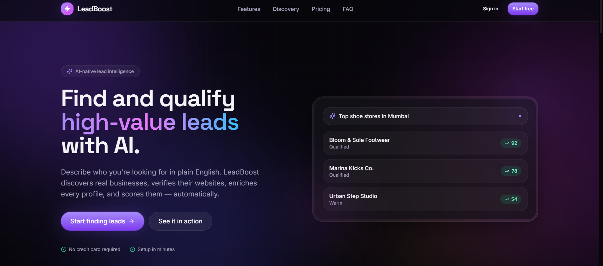
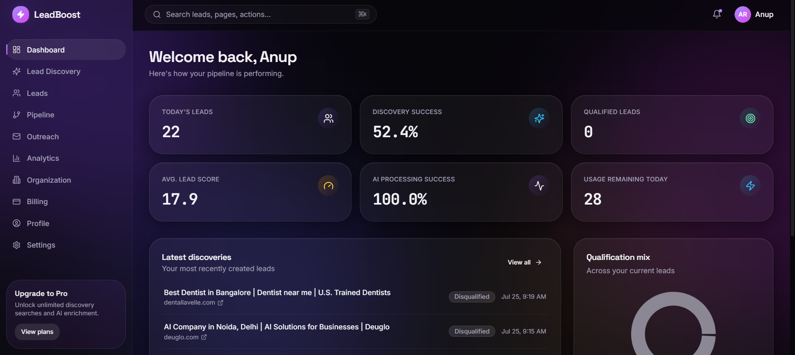
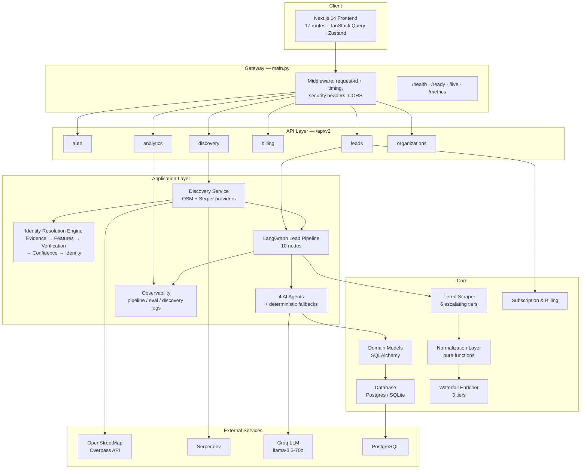
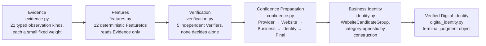
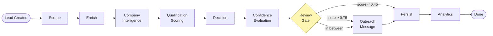

<div align="center">

# LeadBoost

**AI-Powered Lead Discovery, Qualification & Outreach — Built to Never Hallucinate a Fact It Can't Prove**

*Give it a sentence — "top shoe stores in Mumbai" — get back validated businesses with real websites, AI-scored qualification, and a drafted outreach email, end to end, in one API call.*

[](#)
[](#)
[](#)
[](#)
[](#)
[](#-testing)
[](LICENSE)

</div>

---

## See It In Action

<table>
<tr>
<td width="50%"></td>
<td width="50%"></td>
</tr>
</table>

> 📁 Drop your two dashboard screenshots into a `dashboard/` folder at the repo root, named `dashboard-1.png` and `dashboard-2.png`, and this preview renders automatically on GitHub.

---

## Why This Project

LeadBoost isn't a CRUD demo with an OpenAI call bolted on. Underneath a single `POST /discovery/search` endpoint sits a **six-stage identity resolution engine**, a **six-tier escalating web scraper**, a **three-tier waterfall enrichment pipeline**, and a **10-node LangGraph agentic workflow** — each layer deterministic-first, with AI called in only where reasoning is genuinely required, and every AI claim independently checked against the evidence that produced it.

| | |
|---|---|
| **113-query real-world benchmark**, spanning 20+ Indian cities and 15 business categories, with a checked-in, re-runnable evaluation harness — not a synthetic sanity check | **628** automated backend tests across **47** files, exercising discovery, identity resolution, the LangGraph pipeline, billing, auth, and org isolation |
| **~30,000 lines** of production Python + TypeScript across a deterministic discovery engine, an identity-resolution pipeline, a tiered scraper, and a fully-wired Next.js frontend | The system **never fabricates a URL, a technology signal, or a company fact** — every unverifiable claim is either dropped, logged, or explicitly marked as a fallback, not blended in as if it were evidence |

See [Evaluation & Metrics](#-evaluation--metrics) for the benchmark numbers, and [The Identity Resolution Engine](#the-identity-resolution-engine) for the part of this codebase that took the most engineering care.

---

## Table of Contents

1. [What LeadBoost Does](#what-leadboost-does)
2. [High-Level System Architecture](#-high-level-system-architecture)
3. [Full Architecture — Every Layer](#-full-architecture--every-layer)
   - [API Layer](#1-api-layer)
   - [Discovery — Query Understanding & Search](#2-discovery--query-understanding--search)
   - [The Identity Resolution Engine](#the-identity-resolution-engine)
   - [Validation, Deduplication & Ranking](#3-validation-deduplication--ranking)
   - [The Scraping Engine](#4-the-scraping-engine--tieredscraper)
   - [The Normalization Layer](#5-the-normalization-layer)
   - [The Enrichment Engine](#6-the-enrichment-engine--waterfallenricher)
   - [The AI Agents](#7-the-ai-agents)
   - [Lead Scoring](#8-lead-scoring)
   - [The LangGraph Pipeline](#9-the-langgraph-pipeline)
   - [Observability](#10-observability)
4. [End-to-End Pipeline Diagram](#-end-to-end-pipeline-diagram)
5. [Grounding & Hallucination Prevention](#-grounding--hallucination-prevention)
6. [Evaluation & Metrics](#-evaluation--metrics)
7. [Tech Stack](#-tech-stack)
8. [Project Structure](#-project-structure)
9. [API Reference](#-api-reference)
10. [Getting Started](#-getting-started)
11. [Environment Variables](#-environment-variables)
12. [Testing](#-testing)
13. [Deployment](#-deployment)
14. [Engineering Principles](#-engineering-principles)
15. [Roadmap & Known Limitations](#-roadmap--known-limitations)
16. [Author](#-author)
17. [License](#-license)

---

## What LeadBoost Does

A user types a plain-English query — *"electronics stores in Bengaluru"*, *"AI startups in Hyderabad"* — into the dashboard. From there, without any further input:

1. The query is **parsed deterministically** (regex + an 80-city gazetteer — no LLM in this step).
2. Real businesses are found via **OpenStreetMap**, with a **Serper (Google Search)** fallback when OSM has nothing.
3. Each candidate is run through the **identity resolution engine** — an evidence-driven pipeline that decides, with a documented confidence score, whether a website genuinely belongs to *this* business.
4. The resolved website is **independently re-validated** — reachable, HTML, not a directory or social-media page — duplicates are removed, and results are **deterministically ranked**.
5. A `Lead` is created per organization, respecting plan-based quota limits, and fanned out into a **10-node LangGraph pipeline**: a **six-tier scraper** pulls structured company data, a **pure normalization layer** canonicalizes it, a **three-tier waterfall enricher** builds a business profile, four **AI agents** (each with a deterministic fallback) analyze, score, decide, and draft outreach.

The result: a qualified, scored lead with a drafted outreach email, fully explainable, with every AI claim traceable back to either a prompt version or a documented fallback rule.

---

## 🏗 High-Level System Architecture



**Dependency direction is strictly `api → application → core`.** The API layer holds zero business logic; the application layer never touches SQLAlchemy directly (it goes through `services/infra_adapters.py`); core has no knowledge that LangGraph or an LLM exists. This is what makes the discovery layer, the identity resolution engine, and the AI pipeline each independently testable — and independently replaceable — which is exactly what the 628-test suite exercises.

---

## 🧩 Full Architecture — Every Layer

### 1. API Layer

`api/endpoints/` — six routers, all thin HTTP adapters with zero business logic: JWT auth resolution, request validation, and a direct call into the application layer. `auth.py` issues OAuth2-style bearer tokens; every other router depends on `get_current_active_user` to resolve `organization_id` and enforce multi-tenant scoping before touching the database.

### 2. Discovery — Query Understanding & Search

- **`query_parser.py`** — a `QueryParser` class using layered regex patterns (`_QUALIFIER_N_PATTERN` for "top N", `_TOP_PATTERN`, `_PLAIN_PATTERN`, and a gazetteer fallback) plus `locations.py`'s ~80-city `KNOWN_LOCATIONS` set and 12-entry `LOCATION_ALIASES` table (`bombay → Mumbai`, `bangalore → Bengaluru`, …). Zero LLM calls; an unparseable query raises `QueryParseError` → HTTP 422 before any provider is ever called.
- **`providers/overpass_provider.py`** — primary search against OpenStreetMap. ~40-entry category→OSM-tag map, over-fetches 3× the requested limit (capped at 200), and retries through **4 location tiers** (strict administrative boundary → loose area match → alias lookup → landmark-stripped) before giving up — real users type "Bombay" or "near X", and the naive single-query approach returned zero results for a meaningful share of the benchmark.
- **`providers/serper_provider.py`** — fires only when Overpass returns zero candidates. Filters listicles, aggregator domains, and rejected path/extension patterns before a result is even considered a candidate.
- **`business_normalizer.py`** — a small, pure function library (`normalize_overpass_element`) turning a raw Overpass `tags` dict into a typed `BusinessCandidate`: coordinate extraction from `lat/lon` or `center`, address assembly from `addr:*` tags with a full-address shortcut, and URL normalization. Elements with no usable name are dropped rather than surfaced with a placeholder.

### The Identity Resolution Engine

This is the deepest subsystem in the codebase — a six-stage, strictly-layered pipeline that answers one question with a documented, explainable confidence score: *"does this website genuinely belong to this actual business, in this actual location — not a same-named-but-different business, a generic directory, or an unrelated brand that happens to share a word?"*



Built incrementally across four documented "sprints," each one strictly additive — later stages read only the already-computed output of earlier ones, enforced structurally by what each module is even allowed to import (`verification.py`, for instance, imports `features.py` and nothing else — a `Verifier` physically cannot inspect raw provider output because the module never imports its type):

| Module | Responsibility |
|---|---|
| **`evidence.py`** | The foundation. Every stage that has an opinion about a candidate attaches typed `Evidence` (21 kinds defined, e.g. `BRAND_MATCH`, `PROVIDER_AGREEMENT`, `CANONICAL_URL` — 6 actively populated today) with a fixed weight and a human-readable reason. `EvidenceBundle.explain()` renders the full chain that produced a confidence number — nothing here is a black box. |
| **`features.py`** | Depends only on Evidence + `grounding.py` + `dto.py` — never on Identity, which is what keeps the pipeline a one-way graph instead of a cycle. Computes 12 `FeatureId`s (`BRAND_SIMILARITY`, `DOMAIN_QUALITY`, `PROVIDER_AGREEMENT`, `LOCATION_CONSISTENCY`, `EVIDENCE_DENSITY`, …), each an atomic, immutable, documented, deterministic observation. |
| **`verification.py`** | A strategy pattern over Features only — `DomainVerifier`, `BusinessVerifier`, `LocationVerifier`, `WebsiteVerifier`, `IdentityVerifier`, run through a `VerificationPipeline` that's extensible via `.register()` without touching any existing verifier. No single verifier makes the final call; each contributes its own opinion. |
| **`confidence.py`** | Replaces flat, additive confidence ("sum every evidence delta, clamp to \[0,1\]") with genuine **propagation**: Provider Confidence → Website Confidence → Business Confidence → Identity Confidence → Final Confidence, each stage reporting what raised it, what reduced it, and what evidence was missing that could have raised it further. |
| **`identity.py`** | `BusinessIdentity` / `WebsiteCandidateGroup` — the shift from "a business *is* a website" to "a business *has* an identity, of which a website is one attribute." Category-agnostic by construction: no `if restaurant` / `if lawyer` branch anywhere — the same pipeline behaves identically across every business type (regression-tested explicitly: `test_feature_extraction_is_identical_across_categories`). |
| **`digital_identity.py`** | The terminal object, `VerifiedDigitalIdentity` — a judgment of *how good* the resolved identity is, not just a record of *how* it was picked. Wraps `BusinessIdentity` by reference, never a copy. |
| **`competition.py`** | Three related mechanisms: **candidate competition** (score each candidate relative to the others, not only in isolation), **evidence corroboration** (several observations of the *same kind* aren't as informative as several *different kinds*), and **conflict resolution** (contradictions across candidates are surfaced as an explicit, explainable `ConflictRecord` rather than silently averaged away). |
| **`false_positive.py`** | Structural rejection with **zero hardcoded domain lists** — a deliberate constraint. `unsupported_candidate_signal` flags a candidate that's reachable but has zero brand relation, zero location corroboration, and zero provider agreement (structurally indistinguishable from a parked page). `DomainObservationRegistry` / `cross_tenant_signal` extends the same "observed agreement, not a curated list" philosophy across an entire discovery run: a domain that keeps getting proposed for unrelated businesses is flagged by behavior, not by name. |
| **`reliability.py`** | The one deliberately stateful engine in the package — `ProviderReliabilityRegistry` tracks each provider's `agreement_rate`, `verification_success_rate`, and `selection_success_rate` *within a discovery run*, so provider trust evolves from what actually happened rather than a fixed weight, while staying fully explainable (`ProviderReliabilityRecord.explain()`). |
| **`canonicalization.py`** | The shared substrate every other Sprint-3 module builds on: strips `www.` and default ports, normalizes punycode via the stdlib `idna` codec so `café.fr` and its ASCII form canonicalize identically, and correctly computes eTLD+1 for two-label ccTLD suffixes (`co.uk`, `com.au`, …) via a generic compound-suffix table — structural TLD knowledge, not a curated company list. |
| **`grounding.py`** | The shared brand-matching math used by both Serper candidate scoring and final ranking. Tiered `brand_match_strength`: exact match = `1.0`, prefix/suffix = `0.75 + 0.15 × coverage`, fuzzy substring below a `0.6` ratio is rejected outright. Built specifically because naive substring matching let a Mumbai shoe store named "Regal" match an unrelated US cinema chain's domain, and let "Hollywood Walk of Shame" match `walkoffame.com` — both are now rejected. |

`ranking.py` reads directly from this engine's feature store (`_identity_stability_score`, `_selected_feature(identity, FeatureId....)`), so final lead ranking isn't just "does it have a website" — it's informed by the same identity-confidence signal the resolution engine spent five stages building.

### 3. Validation, Deduplication & Ranking

- **`website_validator.py`** — a final, independent reachability check (`WebsiteValidator`) even after the identity engine has picked a candidate: ~37 rejected directory/social domains, `text/html` content-type requirement, redirect-following with the *post-redirect* domain re-checked against the rejection list too (catches a dead business domain parked and redirected into a directory).
- **`duplicate_detector.py`** — in-batch, pure function: registrable domain first, name+phone as a fallback key.
- **`ranking.py`** — deterministic weighted scoring (`score_business`): has-website, category match, location match, domain brand match, contact completeness, rating, and review count, sorted and sliced to the requested limit — no model, no randomness.

### 4. The Scraping Engine — `TieredScraper`

A 2,600+ line, six-tier escalating scraper that only pays for a heavier tier when a lighter one fails, is blocked, or returns low-confidence data:

| Tier | Method | Escalates when |
|---|---|---|
| 1/2 | Static `aiohttp` fetch + deep schema.org/JSON-LD/OpenGraph parsing | Always tried first |
| 3 | `curl_cffi` TLS/JA3 browser-fingerprint impersonation | Confidence `< 0.5` or an anti-bot interstitial was detected |
| 4 | Playwright headless rendering (shared browser pool) | Confidence still `< 0.65` after Tier 3 |
| 5 | Multi-page enrichment — scored, budget-bounded, concurrently-fetched About/Contact/Team/Careers pages, merged with sitemap-discovered URLs | Contact info is thin, **even if confidence already looks high** — a page can score well on a rich Organization schema while exposing zero email/phone |
| 6 | Synchronous `requests` fallback, offloaded to a thread | The page still failed outright or confidence `< 0.2` |

Every tier feeds the **same shared extraction pipeline** (`_parse_page`) — type-aware JSON-LD parsing across `Organization`/`LocalBusiness`/`ContactPoint`/`PostalAddress` schema blocks, obfuscated-email deobfuscation, categorized contact extraction (sales/support/press/privacy/careers), and boilerplate-free main-text extraction via `trafilatura`. New fields are only ever *added* across revisions of this module, never renamed or removed — every key a caller already reads by name keeps working.

### 5. The Normalization Layer

`core/infrastructure/normalization/normalizer.py` — a pure function library (no I/O, no LLM, fully unit-testable with a dict in/dict out) that turns the scraper's opportunistically-merged raw output into clean, canonical fields: email/phone deduplication, structured address parsing, brand-vs-legal-name splitting (*"Metro Brands" vs. "Metro Brands Ltd" are related but not interchangeable*), and — critically — **`extract_organization_type`**, which relays the site's own schema.org self-declaration rather than inferring a business category from keywords. Every rule is based on the *shape* of the data (a schema.org naming convention, a URL pattern, a digit-count pattern), never a hardcoded company name or industry — a new business category needs zero code changes here.

### 6. The Enrichment Engine — `WaterfallEnricher`

A three-tier waterfall, each tier operating on the *same* normalized view so the module never branches on business category:

1. **Deterministic** (highest confidence) — composes a profile purely from `normalize_scraped_fields()`'s canonical output: declared org type, structured facts, ranked contact channels. No industry table, no adjective-based size guessing — if the evidence isn't there, the field is omitted, not guessed.
2. **External API** — a gated placeholder integration point (Clearbit/Apollo/ZoomInfo-shaped), inert until a provider is wired in.
3. **LLM** — the one tier where open-ended inference belongs, used only for what the deterministic tier honestly couldn't determine.

Each tier can short-circuit early when confident enough (deterministic `> 0.7`, API `> 0.6`), but if nothing clears its threshold, `enrich_lead_data` still returns the best-scoring result actually produced — a genuinely-derived, moderate-confidence profile the caller can inspect via `.confidence`, rather than silently discarding it.

### 7. The AI Agents

Every agent shares one contract: attempt an LLM call with a strict JSON schema and bounded retries → on any failure, unavailable key, or invalid payload, fall back to a deterministic, rule-based path. Nothing in the pipeline requires a `GROQ_API_KEY` to complete.

| Agent | LLM path | Deterministic fallback |
|---|---|---|
| **Company Intelligence** | Extracts industry, tech signals, pain points, growth indicators from scraped evidence | `_infer_website_quality` counts independent *kinds* of evidence present (description, org type, tech, offerings, socials, contact, founding year, address) — 5+ signals = "comprehensive," 3+ = "developed," else "minimal." `_infer_icp_alignment` is a plain fraction of 7 boolean completeness checks — a data-completeness proxy, not a judgment call |
| **Decision** | Proposes a qualification label + action | Fixed label→action map (`Hot Lead → proceed`, `Cold Lead → review`, …); an LLM suggestion is accepted **only if it's equal or more conservative** than the rule-based one |
| **Review** | — (zero LLM by design) | Pure threshold gate on the confidence score: `≥0.75` auto-approve, `<0.45` route to human review |
| **Messaging** | Drafts email + LinkedIn opener + follow-up angle in one call | A **"data-locked" template system** (`Messenger`) — explicitly designed to prevent hallucination by falling back to strict templates whenever company context is insufficient, rather than letting a model improvise facts about a company it knows nothing about |

**The hallucination guard that matters most:** `_grounded_technology_signals` in the Company Intelligence agent takes whatever technologies the LLM claims and cross-checks each one, case-insensitively, against the actual evidence text the model was given. Anything not found is silently dropped and logged as a warning — the prompt *asks* the model to only restate what's in evidence, but this function is the actual enforcement, because a prompt instruction is a request, not a guarantee.

### 8. Lead Scoring

`core/domain/services/scoring.py` — `LeadScoringService`, a configurable weighted-linear model, not a black box: industry match (25%), company size fit (20%, partial credit scaled by distance from the preferred employee-count band rather than an all-or-nothing check), email confidence (15%), scrape confidence (15%), enrichment confidence (15%), LinkedIn presence (10%) — summing to a 0–100 score, classified `Hot Lead` (≥80) / `Warm Lead` (≥60) / `Cold Lead` (≥40) / `Disqualified`.

### 9. The LangGraph Pipeline



Every node is wrapped by `_run_stage`, which catches **all** exceptions and appends a structured entry to `state["errors"]` instead of raising — a broken node degrades the run to `PARTIAL_SUCCESS`, never crashes the pipeline. Deterministic confidence scoring closes the loop: `overall = 0.4·confidence + 0.2·completeness + 0.2·grounding + 0.2·consistency`, where **grounding** specifically checks that ≥50% of a claim's substantive words appear in the source text the agent actually saw — a claim with no supporting evidence scores `0.0`.

### 10. Observability

Four additive tables (`pipeline_execution_logs`, `evaluation_report_logs`, `prompt_execution_logs`, `discovery_run_logs`) turn every run into a queryable record without touching the core schema. Structured JSON logs (`stage_start` / `stage_complete` / `stage_failed`) carry duration, retry count, and a correlating `pipeline_id`. A Prometheus `/metrics` endpoint and a pre-provisioned Grafana dashboard read from the same `AnalyticsService` that powers in-app analytics — no second, drift-prone aggregation system. No customer content — no emails, names, or prompt text — ever leaves the metrics pipeline.

---

## 🔗 End-to-End Pipeline Diagram

Every layer above, in one request's journey:

```mermaid
flowchart TB
    subgraph L1["① Query Understanding"]
        A1["Natural-language query"] --> A2["Query Parser<br/>regex + 80-city gazetteer"]
    end

    subgraph L2["② Business Search"]
        A2 --> B1["Overpass — PRIMARY<br/>4-tier location fallback"]
        B1 -->|zero results| B2["Serper — FALLBACK"]
        B1 --> B3["business_normalizer.py"]
        B2 --> B3
    end

    subgraph L3["③ Identity Resolution Engine"]
        B3 --> C1["Evidence"] --> C2["Features"] --> C3["Verification"]
        C3 --> C4["Confidence Propagation"] --> C5["Business Identity"]
        C5 --> C6["Verified Digital Identity"]
    end

    subgraph L4["④ Validate · Dedupe · Rank"]
        C6 --> D1["website_validator.py"] --> D2["duplicate_detector.py"] --> D3["ranking.py"]
    end

    subgraph L5["⑤ Lead Creation"]
        D3 --> E1["Quota check → dedup → create_lead"]
    end

    subgraph L6["⑥ Scraping — 6 tiers"]
        E1 --> F1["TieredScraper<br/>static → curl_cffi → Playwright<br/>→ multi-page → requests fallback"]
    end

    subgraph L7["⑦ Normalization"]
        F1 --> G1["normalizer.py<br/>pure, schema-driven"]
    end

    subgraph L8["⑧ Enrichment — 3 tiers"]
        G1 --> H1["WaterfallEnricher<br/>deterministic → API → LLM"]
    end

    subgraph L9["⑨ AI Agents — LangGraph"]
        H1 --> I1["Company Intelligence"] --> I2["Qualification"] --> I3["Decision"]
        I3 --> I4["Confidence Eval"] --> I5["Review Gate"] --> I6["Messaging"]
        I6 --> I7["Persistence + Analytics"]
    end
```



---

## 🛡 Grounding & Hallucination Prevention

This is the throughline across the entire codebase, not a bullet point bolted on for this README:

- **Deterministic confidence scoring**, computed with zero LLM involvement — `overall = 0.4·confidence + 0.2·completeness + 0.2·grounding + 0.2·consistency` — where grounding checks that ≥50% of a claim's substantive words actually appear in the source text the agent was given.
- **`_grounded_technology_signals`**: any technology the LLM claims a company uses is cross-checked, case-insensitively, against the actual scraped evidence text. Unverified claims are silently dropped and logged — never surfaced to the user as fact.
- **Brand-match scoring** (`grounding.py`): exact name match = `1.0` confidence; prefix/suffix match = `0.75 + 0.15 × coverage`; fuzzy substring below a `0.6` ratio threshold is rejected outright. A low-confidence match never gets promoted to "the business's official website."
- **The Decision Agent cannot escalate its own optimism**: an LLM-proposed action is only accepted if it's *at least as conservative* as the rule-based baseline — the AI can downgrade a lead's priority, never inflate it past what the deterministic rules would allow.
- **A "data-locked" messaging system** (`Messenger`): outreach generation falls back to strict templates whenever company context is insufficient, by design — never letting a model improvise facts about a business it has no real evidence for.
- **Structural false-positive detection with zero hardcoded domain lists** (`false_positive.py`): a candidate is flagged not because its domain matches a curated blocklist, but because it structurally lacks brand relation, location corroboration, and provider agreement — or because it's been observed proposed for unrelated businesses across a run.
- **Websites are never fabricated**: if no candidate in the identity resolution engine passes validation, the field is `null` — reported honestly, never guessed.
- **Three-tier status semantics** (`SUCCESS` / `PARTIAL_SUCCESS` / `FAILED`) so "the platform worked correctly" and "this particular lead looked impressive" are never conflated in the metrics.

---

## 📊 Evaluation & Metrics

The repo ships a **standalone, read-only evaluation harness** (`discovery_eval/`) that runs 113 real-world business-discovery queries — spanning retail, healthcare, food, education, tech, finance, government, and deliberately messy/ambiguous inputs (typos, old city names, brand-only queries) — straight through the production Discovery pipeline. It never creates a database row and never spends AI-pipeline quota; results are checked into the repo for anyone to reproduce with `python -m discovery_eval.run_eval`.

| Metric | Result |
|---|---|
| Discovery benchmark | **113** real-world queries |
| Website validation success | **87.0%** |
| Official website resolution | **88.5%** |
| Query parse success | **100%** |
| Duplicate rate | **1.5%** |

Backend correctness is covered separately by the automated test suite:

| Area | Test files | What's covered |
|---|---|---|
| Discovery + identity resolution | 29 files | Query parsing, both search providers, website resolution/validation, duplicate detection, ranking, identity resolution, competition/conflict, false-positive detection, canonicalization, full integration |
| Application layer | 14 files | LangGraph routing, agents, evaluation scoring, observability, billing, org isolation, prompt registry |
| Infrastructure / API | 4 files | Config validation, Prometheus metrics, billing API, scraper (standalone) |
| **Total** | **47 files / 628 test functions** | **9,600+ lines of test code** against **24,000+ lines of application code** |

---

## 🧰 Tech Stack

<table>
<tr valign="top">
<td width="50%">

**Backend**
- Python 3.12 · FastAPI
- SQLAlchemy 2.0 (PostgreSQL / SQLite)
- LangGraph + LangChain + Groq (`llama-3.3-70b-versatile`)
- Playwright · curl_cffi · aiohttp · trafilatura (tiered scraping)
- Prometheus client · structured JSON logging
- JWT auth (python-jose + PyJWT) · Celery/Redis (legacy health-check target)
- Pytest + pytest-asyncio · Black · Ruff · Mypy

</td>
<td width="50%">

**Frontend**
- Next.js 14 (App Router) · TypeScript (strict)
- Tailwind CSS · Radix UI primitives (custom "glass" design system)
- TanStack Query + TanStack Table
- Zustand · React Hook Form + Zod
- Recharts · Framer Motion · `cmdk` command palette

**Infra / DevOps**
- Docker (multi-stage) · Docker Compose (dev + prod)
- GitHub Actions CI (lint, type-check, tests, Docker build, dependency scan)
- Render (backend) + Vercel (frontend) target deployment

</td>
</tr>
</table>

---

## 📁 Project Structure

```
LeadBoost-saas/
├── backend/
│   ├── api/endpoints/          # HTTP routes only — auth, leads, discovery,
│   │                           # billing, analytics, organizations
│   ├── application/
│   │   ├── discovery/          # 28 modules: query parsing, providers,
│   │   │                       # business_normalizer, website_resolver/validator,
│   │   │                       # duplicate_detector, ranking + the Identity
│   │   │                       # Resolution Engine (evidence, features,
│   │   │                       # verification, confidence, identity,
│   │   │                       # digital_identity, competition, false_positive,
│   │   │                       # reliability, canonicalization, grounding)
│   │   ├── workflows/          # LangGraph graph + 10 node implementations
│   │   ├── agents/             # 4 AI agents, each with a deterministic fallback
│   │   ├── prompts/            # Versioned YAML prompt registry
│   │   ├── evaluation/         # Deterministic confidence scoring
│   │   ├── observability/      # Pipeline/eval/discovery run records + AnalyticsService
│   │   └── memory/             # Business-memory interface + SQL implementation
│   ├── core/
│   │   ├── domain/             # SQLAlchemy models, Pydantic schemas, LeadScoringService
│   │   └── infrastructure/
│   │       ├── scraping/       # TieredScraper — 6 escalating tiers (2,600+ lines)
│   │       ├── enrichment/     # WaterfallEnricher — 3-tier waterfall
│   │       ├── normalization/  # Pure, schema-driven field normalization
│   │       ├── messaging/      # Messenger — data-locked outreach templates
│   │       ├── auth/, billing/, database/
│   ├── discovery_eval/         # Standalone evaluation harness (113-query benchmark)
│   ├── monitoring/             # Prometheus config + provisioned Grafana dashboard
│   ├── tests/                  # 47 files / 628 tests
│   └── docs/                   # ARCHITECTURE, DISCOVERY, DEPLOYMENT, ENVIRONMENT, MONITORING
└── frontend-react/
    └── src/
        ├── app/                # (auth) and (app) route groups — 17 pages
        ├── components/         # design-system primitives + feature components
        ├── features/<domain>/  # api.ts + hooks.ts per backend resource
        └── lib/, store/, types/
```

---

## 🔌 API Reference

All routes are under `/api/v2`, JWT-protected (except register/login), and scoped to the caller's organization.

| Domain | Endpoints |
|---|---|
| **Auth** | `POST /register` · `POST /login` · `POST /refresh` · `GET/PUT /me` |
| **Discovery** | `POST /discovery/search` — natural-language query → validated leads |
| **Leads** | `GET/POST /leads/` · `POST /leads/single` · `GET/PUT/DELETE /leads/{id}` · `POST /leads/{id}/process` |
| **Analytics** | `GET /analytics/pipeline-metrics` · `GET /analytics/evaluation-metrics` · `GET /analytics/discovery-metrics` |
| **Billing** | `GET /usage` · `GET /plans` · `POST /upgrade` · `POST /cancel` |
| **Organizations** | `GET/POST /organizations/` · `GET/PUT /organizations/{id}` |

Interactive Swagger docs are auto-generated at `/docs` when the server is running.

---

## 🚀 Getting Started

### Backend (Docker — fastest path)

```bash
cd backend
cp .env.example .env
# minimum: set SECRET_KEY to a random value; GROQ_API_KEY / SERPER_API_KEY
# are optional — their absence degrades AI features gracefully, not fatally

docker compose up
```

API live at `http://localhost:8000`, interactive docs at `http://localhost:8000/docs`.

### Backend (without Docker)

```bash
cd backend
python -m venv .venv && source .venv/bin/activate
pip install -r requirements.txt
playwright install chromium   # only needed for the scraper's browser tier

export DATABASE_URL="sqlite:///./dev.db"
export SECRET_KEY="$(python -c 'import secrets; print(secrets.token_urlsafe(48))')"

uvicorn main:app --reload
```

### Frontend

```bash
cd frontend-react
npm install
cp .env.example .env.local   # set NEXT_PUBLIC_API_URL to your backend
npm run dev
```

Open `http://localhost:3000`. The public marketing page is served at `/`; everything under `/dashboard`, `/leads`, `/discovery`, etc. requires a session.

---

## ⚙️ Environment Variables

Full reference in [`backend/docs/ENVIRONMENT.md`](backend/docs/ENVIRONMENT.md). The essentials:

| Variable | Required? | Effect if unset |
|---|---|---|
| `SECRET_KEY` | Yes in production | App refuses to start in production without a real, ≥32-char value |
| `DATABASE_URL` | Yes in production | Must be `postgresql://` in production; SQLite is dev-only |
| `ALLOWED_ORIGINS` | Yes in production | CORS allowlist — never `*` in production, enforced at startup |
| `GROQ_API_KEY` | No | AI stages (enrichment, qualification, decisioning, outreach) fall back to deterministic paths |
| `SERPER_API_KEY` | No | Website-resolution fallback and discovery fallback simply don't fire |
| `OVERPASS_API_URL` | No | Defaults to the public Overpass instance |
| `DISCOVERY_MAX_CONCURRENT_PIPELINES` | No | Defaults to `3` |

---

## 🧪 Testing

```bash
cd backend
pip install pytest pytest-asyncio
pytest tests/ --ignore=tests/scraper
```

`tests/scraper/` contains standalone verification scripts meant to be run directly with `python`, not collected by pytest.

To re-run the Discovery evaluation benchmark against a live environment:

```bash
python -m discovery_eval.run_eval             # full 113-query benchmark
python -m discovery_eval.run_eval --limit 10   # quick smoke run
```

---

## ☁️ Deployment

Target shape: **frontend → Vercel, backend → Render.** Full walkthrough in [`backend/docs/DEPLOYMENT.md`](backend/docs/DEPLOYMENT.md), including health-check configuration, required environment variables, and an optional self-hosted VPS path via `docker-compose.prod.yml` (backend + Postgres + Redis + MinIO + pgAdmin + Prometheus + Grafana, `deploy/nginx.conf` for TLS termination).

---

## 🎯 Engineering Principles

These are the constraints that shaped every design decision in this repo, applied consistently from the identity resolution engine down to the observability layer:

- **Fail loud, never silently default.** A stage that can't complete raises a structured error into `state["errors"]`; it doesn't quietly return an empty-but-successful result.
- **Grounding over confidence theater.** Every AI-generated claim either traces back to evidence in the source text or is explicitly marked as a fallback/heuristic output — never blended together as if both were equally reliable.
- **Structural signals over hardcoded lists.** The false-positive detector and the canonicalization engine work off the *shape* of data (TLD structure, cross-run behavior, evidence density) rather than curated domain lists — the exception being `website_validator.py`'s deliberately explicit, human-reviewed rejection list for known directories/social platforms.
- **Dependency injection over singletons.** `DiscoveryService` depends only on provider interfaces (`BusinessSearchProvider`, `WebsiteResolverProvider`), never concrete classes — which is what makes 600+ tests possible without a single real network call.
- **Strict layering, enforced by imports, not convention.** `verification.py` cannot import `evidence.py`'s types even if a future author wanted to cut a corner — the layering discipline is structural, not a code-review rule that erodes over time.
- **Empirical verification over speculation.** The 113-query evaluation benchmark exists precisely so that changes to Discovery are measured against real output, not assumed to be improvements.
- **Minimal-change discipline.** Every documented change in this codebase's history is scoped to exactly what was asked — no drive-by refactors, no unrequested frameworks, no schema changes without a concrete need.

---

## 🗺 Roadmap & Known Limitations

Documented honestly, because a production system with zero caveats is usually one that hasn't been looked at closely enough:

- **Stripe billing is scaffolded but not wired to process real payments** — usage-limit enforcement is fully active; the `/upgrade` endpoint currently returns "coming soon" by design.
- **No Alembic migrations yet** — schema is managed via `create_all()` at startup, sufficient pre-launch, called out as the first thing to add once there's a live database with real data to preserve.
- **No DB connection-pool or cache-hit metrics** — there's no caching layer yet to instrument; the Prometheus setup is structured so these drop in easily when one is added.
- **Single-worker Uvicorn by design** on memory-constrained deployment targets — the workload is I/O-bound, so this is a deliberate tradeoff, documented as the first lever to reconsider under real CPU pressure.
- **External-API enrichment tier is a gated placeholder** — `WaterfallEnricher`'s second tier is wired for a provider like Clearbit/Apollo but inert until one is actually connected.

---

## 👤 Author

**Arnav** — AI Engineer

Built and hardened end-to-end: the identity resolution engine, the tiered scraper, the waterfall enrichment pipeline, the LangGraph agentic workflow, the observability layer, and the evaluation harness that keeps all of it honest.

<!-- Add your links here: -->
<!-- [LinkedIn](#) · [GitHub](#) · [Portfolio](#) · [Email](#) -->

---

## 📄 License

Released under the [MIT License](LICENSE).