# LeadBoost Backend — Full Architecture & Workflow Reference

> Code-grounded architecture document for `backend/`. Every claim below is traceable to real
> files and functions; constants are quoted verbatim from source. `backend/scripts/` and
> `backend/tests/` are intentionally excluded per scope.

---

## Table of Contents

1. [System Overview](#1-system-overview)
2. [Layered Architecture Diagram](#2-layered-architecture-diagram)
3. [Entry Point — `main.py`](#3-entry-point--mainpy)
4. [Configuration — `core/config.py`](#4-configuration--coreconfigpy)
5. [API Layer — `api/endpoints/`](#5-api-layer--apiendpoints)
6. [The "Top shoe stores in Mumbai" End-to-End Workflow](#6-the-top-shoe-stores-in-mumbai-end-to-end-workflow)
7. [Discovery Subsystem — `application/discovery/`](#7-discovery-subsystem--applicationdiscovery)
8. [AI Lead Pipeline — `application/workflows/` + agents](#8-ai-lead-pipeline--applicationworkflows--agents)
9. [Application Support Modules](#9-application-support-modules)
10. [Core Domain — `core/domain/`](#10-core-domain--coredomain)
11. [Core Infrastructure — `core/infrastructure/`](#11-core-infrastructure--coreinfrastructure)
12. [Observability — metrics, logging, analytics](#12-observability--metrics-logging-analytics)
13. [Database Schema (ER Diagram)](#13-database-schema-er-diagram)
14. [Full Per-File Responsibility Table](#14-full-per-file-responsibility-table)
15. [Inter-File Dependency Map](#15-inter-file-dependency-map)
16. [Known Gaps & Intentional Stubs](#16-known-gaps--intentional-stubs)

---

## 1. System Overview

LeadBoost is a multi-tenant B2B lead-generation SaaS backend. It has **two major workflows**:

1. **Business Discovery** (deterministic, LLM-free): a natural-language query such as
   *"Top shoe stores in Mumbai"* is parsed, real businesses are found via OpenStreetMap
   (Overpass API) with a Google-Serper fallback, websites are resolved and validated,
   duplicates removed, results ranked deterministically, and Leads created in the database.
2. **AI Lead Pipeline** (LangGraph-orchestrated): each created Lead is processed through a
   10-node graph — scrape → enrich → company intelligence → qualification scoring →
   decision → confidence evaluation → review gating → message generation → persistence →
   analytics. Every LLM-backed agent has a deterministic fallback, so the pipeline
   completes even without a `GROQ_API_KEY`.

Key technologies (verified in code): **FastAPI** ("LeadBoost SaaS API" v2.0.0),
**SQLAlchemy** (PostgreSQL prod / SQLite dev), **LangGraph + LangChain + Groq**
(`llama-3.3-70b-versatile` default), **aiohttp / curl_cffi / Playwright** tiered scraping,
**Prometheus** metrics, JWT auth (30-min access tokens), org-scoped multi-tenancy, and
plan-based feature gating (free / pro / enterprise).

### Architectural style

Clean layering with dependency direction `api → application → core`:

- `api/endpoints/` — HTTP routes only (auth checks, validation, delegation).
- `application/` — use-cases: discovery service, LangGraph pipeline, agents, prompts,
  evaluation, memory, observability records. Talks to `core` via `services/infra_adapters.py`.
- `core/domain/` — SQLAlchemy models, Pydantic schemas, deterministic scoring service.
- `core/infrastructure/` — DB engine/CRUD, auth/JWT, billing, scraping, enrichment,
  messaging, normalization, logging, (dormant) Celery worker.

---

## 2. Layered Architecture Diagram

```mermaid
graph TB
    subgraph Clients
        FE["Next.js Frontend"]
        PROM["Prometheus scraper"]
    end

    subgraph "Gateway — main.py"
        MW["Middleware: request-id + timing,<br/>security headers, CORS"]
        HEALTH["/health /ready /live /metrics"]
    end

    subgraph "API Layer — api/endpoints/ (all under /api/v2)"
        AUTH_EP["auth.py<br/>register/login/refresh/me"]
        LEADS_EP["leads.py<br/>CRUD + batch + /process"]
        DISC_EP["discovery.py<br/>POST /discovery/search"]
        BILL_EP["billing.py<br/>usage/upgrade/plans/cancel"]
        ANA_EP["analytics.py<br/>pipeline/eval/discovery metrics"]
        ORG_EP["organizations.py<br/>org CRUD"]
    end

    subgraph "Application Layer — application/"
        DISCS["discovery/<br/>DiscoveryService + providers"]
        PIPE["workflows/<br/>LangGraph LeadPipeline"]
        AGENTS["agents/<br/>4 AI agents"]
        PROMPTS["prompts/<br/>versioned YAML registry"]
        EVAL["evaluation + explainability"]
        MEM["memory/<br/>SQLBusinessMemory"]
        OBS["observability/<br/>run records + AnalyticsService"]
        ADAPT["services/infra_adapters.py<br/>(bridge to core)"]
    end

    subgraph "Core Domain — core/domain/"
        MODELS["models/ (SQLAlchemy)"]
        SCHEMAS["schemas/ (Pydantic)"]
        SCORING["services/scoring.py"]
    end

    subgraph "Core Infrastructure — core/infrastructure/"
        DB["database/ engine + CRUD"]
        SEC["auth/security.py JWT"]
        BILLS["billing/ subscription + stripe"]
        SCRAPE["scraping/ TieredScraper"]
        ENRICH["enrichment/ WaterfallEnricher"]
        NORM["normalization/normalizer.py"]
        MSG["messaging/messenger.py"]
        LOGS["logging/ JSON logger"]
        CELERY["workers/orchestrator.py (dormant)"]
    end

    subgraph External
        OSM["Overpass API (OpenStreetMap)"]
        SERPER["Serper.dev (Google Search)"]
        GROQ["Groq LLM API"]
        STRIPE["Stripe (partially wired)"]
        PG["PostgreSQL"]
        REDIS["Redis (health check / celery broker)"]
    end

    FE --> MW --> AUTH_EP & LEADS_EP & DISC_EP & BILL_EP & ANA_EP & ORG_EP
    PROM --> HEALTH
    DISC_EP --> DISCS
    LEADS_EP --> PIPE
    ANA_EP --> OBS
    AUTH_EP --> SEC
    BILL_EP --> BILLS
    DISCS --> OSM & SERPER
    DISCS --> PIPE
    PIPE --> AGENTS --> PROMPTS
    AGENTS --> GROQ
    PIPE --> EVAL & MEM & OBS
    PIPE --> ADAPT
    ADAPT --> SCRAPE & ENRICH & SCORING & MSG & BILLS
    ENRICH --> NORM
    DISCS & PIPE & AUTH_EP --> DB
    BILLS --> STRIPE
    DB --> PG
    HEALTH --> REDIS
```

---

## 3. Entry Point — `main.py`

**Responsibility:** FastAPI application gateway. Owns app creation, lifespan, middleware,
health probes, the Prometheus endpoint, and router registration. Contains no business logic.

### 3.1 Startup / shutdown (lifespan)

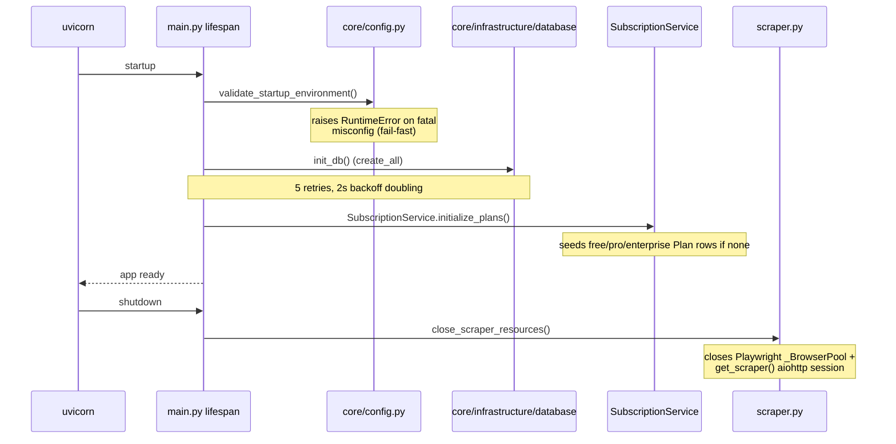

### 3.2 Middleware chain (order matters)

| Middleware | What it does |
|---|---|
| `add_request_id_and_timing` | Generates `X-Request-ID`, measures duration, sets `X-Response-Time`, increments Prometheus `http_requests_total` / observes `http_request_duration_seconds` labeled by **route template** (via `prometheus_metrics.route_template`, bounding label cardinality) |
| `add_security_headers` | `X-Content-Type-Options: nosniff`, `X-Frame-Options: DENY`, HSTS `max-age=31536000` |
| CORS | Origins from `ALLOWED_ORIGINS` env, `max_age=600` |
| Global exception handler | Any unhandled error → HTTP 500 with the request_id in the body |

### 3.3 Operational endpoints

| Endpoint | Behavior |
|---|---|
| `GET /health` | DB `SELECT 1` + Redis ping (URL from `CELERY_BROKER_URL`, default `redis://localhost:6379/0`); **503** if either unhealthy |
| `GET /ready` | readiness probe |
| `GET /live` | liveness probe |
| `GET /metrics` | **Unauthenticated by design**; `prometheus_metrics.render_latest(db)` — refreshes scrape-time gauges then renders |

### 3.4 Server & routers

- Uvicorn: `API_HOST` (default `0.0.0.0`), `API_PORT` (default `8000`), auto-reload only when
  `ENVIRONMENT=development`.
- Routers all mounted at prefix **`/api/v2`**: `auth`, `leads`, `organizations`, `billing`,
  `analytics`, `discovery`.

---

## 4. Configuration — `core/config.py`

**Responsibility:** NOT a settings class. A single fail-fast function
`validate_startup_environment()` called once from the lifespan. Env vars are otherwise read
at their call sites throughout the codebase.

**Fatal in production** (raises aggregated `RuntimeError`):

- `SECRET_KEY` equals the insecure default `"your-super-secret-key-change-in-production"`
- `SECRET_KEY` shorter than 32 chars
- `DATABASE_URL` not `postgresql://…`
- `*` present in `ALLOWED_ORIGINS`

**Warning-only** (logged, never raises): missing `GROQ_API_KEY`, `SERPER_API_KEY`,
`STRIPE_SECRET_KEY` — the system degrades gracefully without each of them.

---

## 5. API Layer — `api/endpoints/`

Every endpoint uses `Depends(get_db)` (request-scoped session from
`core/infrastructure/database`) and `Depends(get_current_active_user)` (JWT chain from
`core/infrastructure/auth/security.py`) unless noted. All organization access is checked
against `current_user.organization_id` (multi-tenant isolation).

### 5.1 `auth.py` (no sub-prefix)

| Route | Behavior |
|---|---|
| `POST /register` | **Atomic**: creates `Organization` named `"{first_name}'s Organization"` + `User` + default subscription plan from `DEFAULT_PLAN` env (default `"free"`) |
| `POST /login` | OAuth2 form; issues 30-min access token + refresh token; increments `auth_attempts_total{result}`; 401 on bad credentials or inactive user |
| `POST /refresh` | Requires JWT with `token_type == "refresh"`; issues new access token |
| `GET /me`, `PUT /me` | Current-user profile read/update |

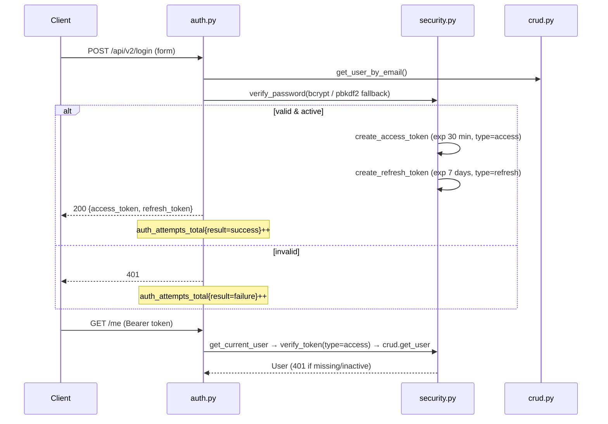

### 5.2 `leads.py` (prefix `/leads`)

| Route | Behavior |
|---|---|
| `POST /` | **Batch create**: max 100 URLs (400 above), dedupe + lowercase, quota check via `SubscriptionService.can_create_lead` (429 `"Daily lead limit exceeded"`), then `background_tasks.add_task(run_lead_pipeline, lead.id)` per lead |
| `POST /single` | Single-lead variant of the above |
| `GET /` | Paginated list (skip ≥ 0, limit 1–1000, default 100), org-scoped |
| `GET /{lead_id}` | 404 if absent, 403 if other org |
| `PUT /{lead_id}` | Field update via `LeadUpdate` schema |
| `DELETE /{lead_id}` | **Soft delete** (`is_active=False`) |
| `POST /{lead_id}/process` | 403 unless `can_use_ai_features`; **awaits** `run_lead_pipeline(lead_id)` synchronously and returns the `PipelineResult` |

### 5.3 `discovery.py` (prefix `/discovery`)

| Route | Behavior |
|---|---|
| `POST /search` | Body `DiscoverySearchRequest`: `query` (min_length=3, max_length=200, documented example is literally `"Top shoe stores in Mumbai"`), `limit` (1–50). Calls `DiscoveryService.discover_and_create_leads(query, organization_id, owner_id, limit)`. `QueryParseError` → **422**; provider/other failures → **502** |

### 5.4 `billing.py` (no sub-prefix)

| Route | Behavior |
|---|---|
| `GET /usage` | `SubscriptionService.get_organization_usage` → `PlanUsage` DTO |
| `POST /upgrade` | **Intentional stub** → HTTP **402** `"Online payments coming soon."`; validates plan ∈ {free, pro, enterprise} first |
| `GET /plans` | Lists the 3 seeded plans |
| `POST /cancel` | `SubscriptionService.cancel_subscription` (immediate or at period end) |

### 5.5 `analytics.py` (prefix `/analytics`)

| Route | Behavior |
|---|---|
| `GET /pipeline-metrics` | `AnalyticsService.get_pipeline_metrics` (optional `hours` window) |
| `GET /evaluation-metrics` | `AnalyticsService.get_evaluation_metrics` |
| `GET /discovery-metrics` | `AnalyticsService.get_discovery_metrics` |

### 5.6 `organizations.py` (prefix `/organizations`)

`POST /`, `GET /`, `GET /{org_id}`, `PUT /{org_id}` — strict membership checks: any access to
an org the current user doesn't belong to → **403**.

---

## 6. The "Top shoe stores in Mumbai" End-to-End Workflow

This is the complete file-by-file trace of what happens when a user submits
`POST /api/v2/discovery/search` with `{"query": "Top shoe stores in Mumbai", "limit": 10}`.

### 6.1 Master sequence diagram

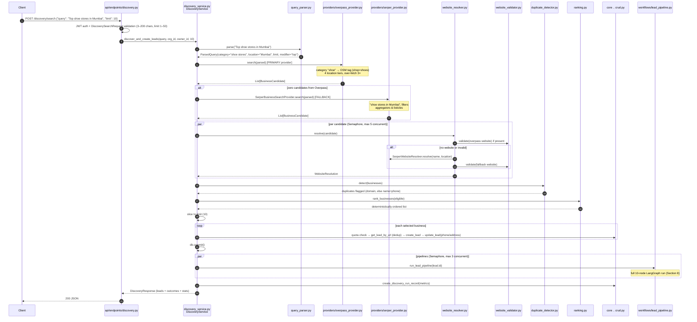

### 6.2 Step 1 — HTTP entry: `api/endpoints/discovery.py`

- FastAPI validates `DiscoverySearchRequest` (`query` 3–200 chars, `limit` 1–50).
- Auth: `get_current_active_user` resolves the JWT → user → `organization_id`, `owner_id`.
- Delegates entirely to `DiscoveryService`; maps `QueryParseError` → 422, anything else → 502.

### 6.3 Step 2 — Query parsing: `application/discovery/query_parser.py`

Deterministic regex + gazetteer parser (no LLM). Constants: `_DEFAULT_LIMIT = 20`,
`_MAX_LIMIT = 100`.

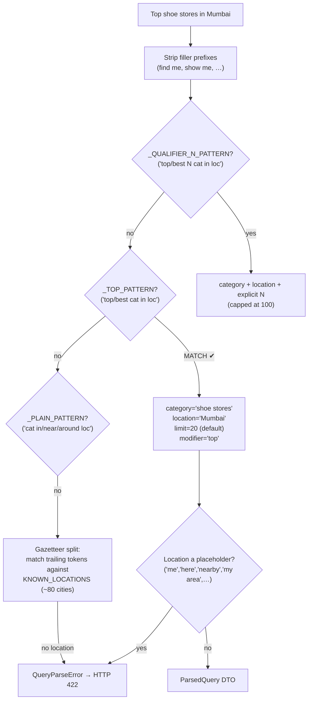

Additional behaviors: prepositions recognized are `located in | situated in | close to |
around | near | in`; a trailing `"for X"` purpose qualifier is folded into the category.
`locations.py` supplies `LOCATION_ALIASES` (12 entries, e.g. `bangalore→Bengaluru`,
`bombay→Mumbai`), `_LANDMARK_SUFFIXES`, and `KNOWN_LOCATIONS` (~80 cities).

For our query: **`_TOP_PATTERN` matches → `ParsedQuery(category="shoe stores",
location="Mumbai", limit=20, modifier="top")`**.

### 6.4 Step 3 — Business search: Overpass primary, Serper fallback

`DiscoveryService._search` tries `OverpassProvider` first; the
`SerperBusinessSearchProvider` fallback fires **only when Overpass returns zero candidates**.

#### `providers/overpass_provider.py`

- `_CATEGORY_TAG_MAP` (~40 entries) maps `"shoe"` → OSM tag `("shop", "shoes")`.
- Default endpoint `https://overpass-api.de/api/interpreter` (env `OVERPASS_API_URL`);
  HTTP timeout **25s**, in-query Overpass timeout **20s**.
- Over-fetches **3× the requested limit, capped at 200** raw elements.
- Retry: 3 attempts, exponential wait 1.0–5.0s.
- Tries up to **4 location tiers** until one yields results:

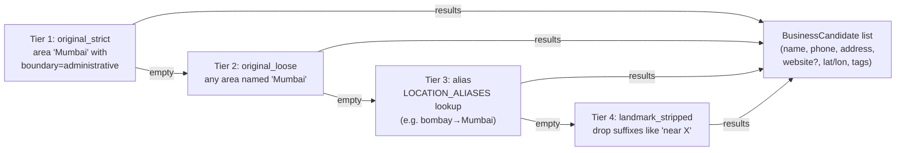

#### `providers/serper_provider.py` — `SerperBusinessSearchProvider` (fallback)

- Query template `"{category} in {location}"` → `"shoe stores in Mumbai"`, POST to
  `https://google.serper.dev/search`, `num = max(limit*2, 10)`.
- Filters out non-business results using: `_AGGREGATOR_DOMAINS` (12 domains, e.g. Justdial,
  Yelp-style directories), `_LISTICLE_TITLE_PATTERN` ("10 best…"), `_REJECTED_PATH_SUBSTRINGS`,
  `_REJECTED_EXTENSIONS`.

#### `providers/http_utils.py`

Shared `get_json` / `post_json` helpers — retry 2 attempts (wait 1.0–4.0s); non-200 raises
`ProviderHTTPError` and is **not** retried.

### 6.5 Step 4 — Website resolution & validation

`DiscoveryService._resolve_and_validate` runs per-candidate under an
`asyncio.Semaphore(DISCOVERY_MAX_CONCURRENT_RESOLUTIONS)` (env default `"5"`).

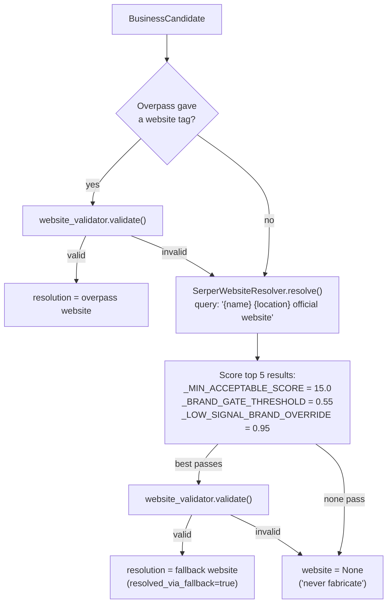

**`website_validator.py`** rules (verbatim constants):

- `REJECTED_DOMAINS` — ~37 domains (facebook, justdial, indiamart, tradeindia, zomato,
  swiggy, …) → immediate reject (a social/aggregator page is not the business's own site).
- `_ACCEPTED_STATUS_CODES = (200, 301, 302)`.
- Timeout `DISCOVERY_VALIDATOR_TIMEOUT_SECONDS` default **15s**; browser-like headers;
  `Accept-Encoding` deliberately excludes Brotli.
- Retry 2 attempts; 429/503 retryable.
- Checks content-type is `text/html` and the **post-redirect domain** isn't rejected.

**`grounding.py`** provides the brand-matching math used by the Serper resolver:
`_MIN_BRAND_WORD_LEN = 4`, `_MIN_PREFIX_WORD_LEN = 5`; `brand_match_strength` tiers —
exact = `1.0`, prefix/suffix = `0.75 + 0.15 × coverage`, substring ratio ≥ 0.6 →
`ratio × 0.85`; plus `is_low_signal_business_name` detection.

Legacy alternative: **`providers/brave_provider.py`** (`BraveWebsiteResolver`,
`BRAVE_API_KEY`) is still injectable but superseded by Serper as the default resolver.

### 6.6 Step 5 — Duplicate detection: `duplicate_detector.py`

In-batch only (DB-level dedup happens later at lead creation). Dedup key priority:
**registrable domain** first (e.g. `nike.com`), else **normalized name + phone**. Later
occurrences are flagged `duplicate`.

### 6.7 Step 6 — Deterministic ranking: `ranking.py`

Only businesses that are `validated and not duplicate` are eligible. Verbatim weights:

| Signal | Points | Notes |
|---|---|---|
| `_HAS_WEBSITE_POINTS` | **40.0** | validated own website |
| `_CATEGORY_MATCH_POINTS` | **20.0** | 50% partial credit via name-word overlap |
| `_LOCATION_MATCH_POINTS` | **15.0** | 50% partial credit via domain hints |
| `_DOMAIN_BRAND_MATCH_MAX_POINTS` | **15.0** | scaled by `brand_match_strength` |
| `_CONTACT_COMPLETENESS_MAX_POINTS` | **15.0** | phone/address presence |
| `_RATING_MAX_POINTS` | **10.0** | if provider gave a rating |
| `_REVIEW_COUNT_MAX_POINTS` | **10.0** | `log1p(count) × 2.0`, capped |

Result list is sorted by score desc, then sliced to the requested `limit`.

### 6.8 Step 7 — Lead creation & pipeline fan-out (`discovery_service.py`)

For each selected business, `_create_leads_and_run_pipelines`:

1. `SubscriptionService.can_create_lead` quota check → outcome `quota_exceeded` if over.
2. `crud.get_lead_by_url(website, org_id)` → outcome `duplicate` if the Lead already exists.
3. `crud.create_lead(LeadCreate(website, organization_id, owner_id))`.
4. Pre-seeds `phone` / `address` from discovery data via `crud.update_lead`.
5. `db.commit()`, then `_run_pipelines` awaits `run_lead_pipeline(lead.id)` for every new
   lead under `asyncio.Semaphore(DISCOVERY_MAX_CONCURRENT_PIPELINES)` (env default `"3"`).

Outcome statuses per business (from `dto.py` → `LeadCreationOutcome`): `validated`,
`not_selected`, `no_website`, `duplicate`, `validation_failed`, `quota_exceeded`,
`pipeline_error`.

### 6.9 Step 8 — Metrics & response

`_record_metrics` writes one `DiscoveryRunRecord` row (table `discovery_run_logs`) with:
query, category, location, requested_limit, businesses_returned,
businesses_missing_website, websites_resolved_via_fallback, duplicates_removed,
validated_leads, duration_ms. The client receives a `DiscoveryResponse` containing the
created leads plus every non-selected/rejected outcome with its reason.

---

## 7. Discovery Subsystem — `application/discovery/`

Per-file responsibilities (the flow itself is Section 6):

| File | Responsibility |
|---|---|
| `discovery_service.py` | Orchestrator; the **only** discovery file touching DB/LeadPipeline. Pipeline: parse → search → resolve/validate → dedupe → rank → create leads → run pipelines → record metrics |
| `query_parser.py` | Deterministic NL query → `ParsedQuery` (category/location/limit/modifier); raises `QueryParseError` |
| `locations.py` | Location gazetteer: `LOCATION_ALIASES` (12), `KNOWN_LOCATIONS` (~80 cities), `_LANDMARK_SUFFIXES` |
| `providers/base.py` | Provider interface (search provider / website resolver contracts) |
| `providers/overpass_provider.py` | Primary business search on OpenStreetMap; category→OSM-tag map; 4-tier location fallback |
| `providers/serper_provider.py` | `SerperWebsiteResolver` (default website-resolution fallback) + `SerperBusinessSearchProvider` (business-search fallback); aggregator/listicle filtering |
| `providers/brave_provider.py` | Legacy `BraveWebsiteResolver` (optional, `BRAVE_API_KEY`); superseded by Serper but injectable |
| `providers/http_utils.py` | Shared HTTP JSON helpers with retry; `ProviderHTTPError` |
| `website_resolver.py` | Resolution priority logic: provider website → validate → fallback resolver → validate → else `None` (never fabricate) |
| `website_validator.py` | HTTP-level validation: status/content-type/redirect-domain checks + `REJECTED_DOMAINS` blocklist |
| `duplicate_detector.py` | In-batch dedup by domain, else name+phone |
| `ranking.py` | Deterministic 0–125-point scoring & ordering (weights in §6.7) |
| `grounding.py` | Brand-name ↔ domain matching strength math shared by resolver & ranking |
| `business_normalizer.py` | Normalizes provider payloads into `BusinessCandidate` fields (names, phones, addresses) |
| `dto.py` | `ParsedQuery`, `BusinessCandidate`, `WebsiteResolution`, `DiscoveredBusiness`, `LeadCreationOutcome`, `DiscoveryResponse` |
| `exceptions.py` | `DiscoveryError` → `QueryParseError`, `ProviderError(provider)`, `WebsiteValidationError` |

Discovery module dependency graph:

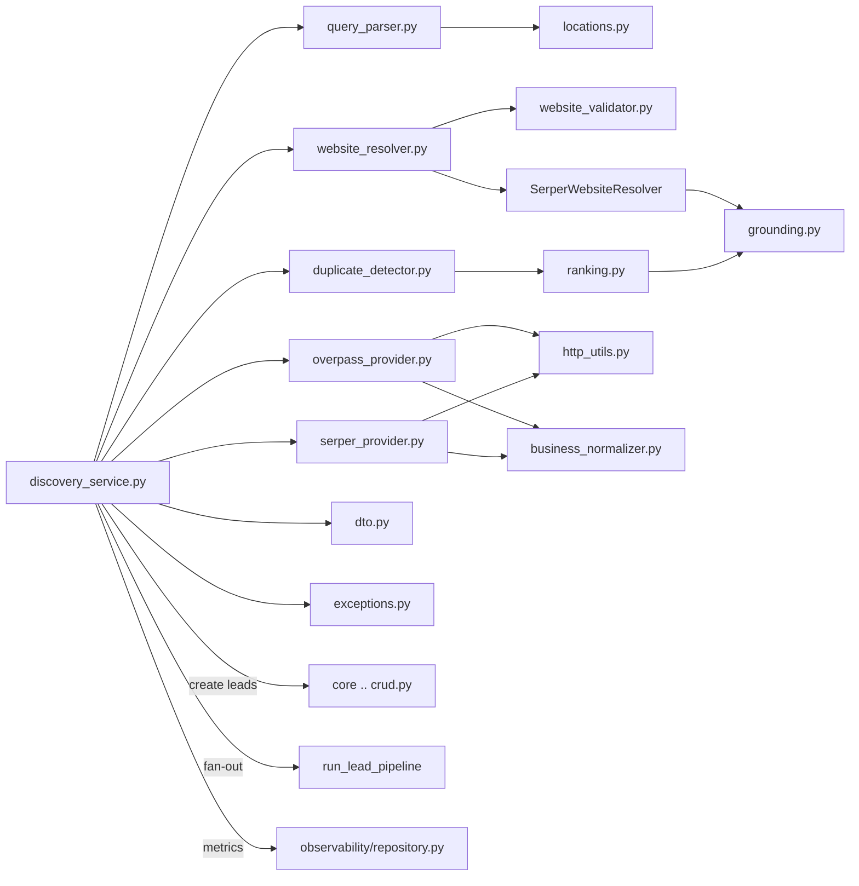

---

## 8. AI Lead Pipeline — `application/workflows/` + agents

### 8.1 `workflows/lead_pipeline.py` — the LangGraph graph

**Responsibility:** Builds and executes the 10-node LangGraph `StateGraph(LeadState)`;
owns pipeline status semantics and execution-record persistence.

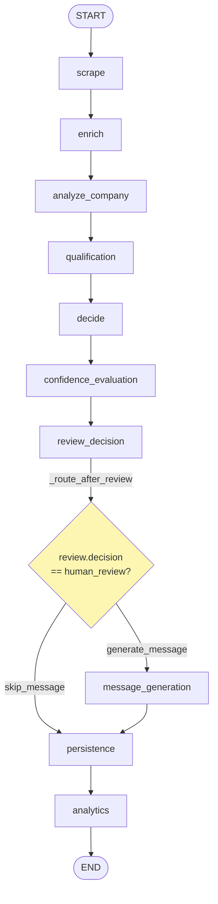

The **only conditional edge** in the whole graph is `_route_after_review`:
`review.decision == "human_review"` → `"skip_message"` (straight to persistence),
otherwise `"generate_message"`.

`execute(lead_id)` flow:

1. Generate a UUID `pipeline_id`.
2. Load the Lead — **not found → `FAILED` immediately** (no `PipelineExecutionRecord` is
   written because there is no FK target).
3. `check_ai_features_enabled(db, organization_id)` → stored in state as
   `ai_features_enabled` (plan gating, see §11.2).
4. `graph.ainvoke(initial_state)` wrapped in a safety-net `try/except` — a graph runtime
   exception is the only other path to `FAILED`.
5. **Status rule:** `SUCCESS` iff the `errors` list is empty, else `PARTIAL_SUCCESS`.
   `FAILED` is reserved for lead-not-found or a graph-level exception.
6. `_record_execution` writes a `PipelineExecutionRecord` best-effort (never raises).

`run_lead_pipeline(lead_id)` is the public entry: opens its **own `SessionLocal()`**,
rolls back + returns a `FAILED` dict on exception, closes the session in `finally`. It is
invoked from `api/endpoints/leads.py` via `background_tasks.add_task` (single + batch
creation) and awaited directly by `POST /leads/{id}/process`. `DiscoveryService` fans out
to it as well (§6).

### 8.2 `workflows/graph_nodes.py` — the 10 node implementations

**Responsibility:** One async function per graph node; all wrapped by `_run_stage`.

`_run_stage` (the graceful-degradation core): wraps every node in `stage_span`
(structured start/complete/failed logs), records the duration in
`state["stage_timings_ms"]`, **catches ALL exceptions** and appends `{stage, error}` to
`state["errors"]` instead of raising — this is why a broken node yields
`PARTIAL_SUCCESS`, never a crashed pipeline.

| Node | What it does | Files it calls |
|---|---|---|
| `scrape` | `infra_adapters.scrape_lead` (TieredScraper), writes a `ScrapingLog`, updates Lead scrape fields | `services/infra_adapters.py`, `scraping/scraper.py`, `crud.py` |
| `enrich` | **Skipped when AI features disabled**; `asyncio.to_thread(enrich_lead)` (WaterfallEnricher), writes `LeadEnrichmentLog` | `infra_adapters.py`, `enrichment/enricher.py` |
| `analyze_company` | `ContextBuilder.build` → `CompanyIntelligenceAgent.run` (in a thread) → `memory.store` → `PromptExecutionRecord` if source was LLM | `context/context_builder.py`, `agents/company_intelligence_agent.py`, `memory/db_memory.py`, `observability/repository.py` |
| `qualification` | `score_lead` with the optional `CompanyIntelligenceOutput` | `infra_adapters.py`, `core/domain/services/scoring.py` |
| `decide` | Builds `DecisionContext` → `DecisionAgent.run` | `agents/decision_agent.py` |
| `confidence_evaluation` | Fully deterministic `build_evaluation_report`; expected fields `qualification`, `recommended_action`; source text = about_text + scraped `text_content` + industry analysis; writes `EvaluationReportRecord` | `evaluation/evaluators.py`, `observability/repository.py` |
| `review_decision` | `ReviewAgent.run` (threshold gating, zero LLM) | `agents/review_agent.py` |
| `message_generation` | If AI disabled → `_FREE_TIER_MESSAGE = "No outreach message generated - AI features not available on your plan"`; if human_review → skipped by routing; else `MessagingAgent.run` + `update_lead(outreach_message=email_body)` | `agents/messaging_agent.py`, `crud.py` |
| `persistence` | `db.commit()` only — makes all accumulated ORM changes durable | `database/` |
| `analytics` | Emits one structured log line `event=pipeline_analytics` with timings + status | `logging/` |

### 8.3 The four agents — `application/agents/`

All agents share the same pattern (`base.py` provides the common `BaseAgent` machinery):

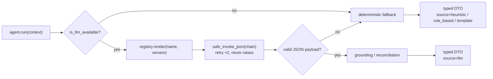

| Agent | Prompt / temp / max_tokens | LLM path | Deterministic fallback |
|---|---|---|---|
| `company_intelligence_agent.py` | `company_intelligence` v1, temp **0.1**, max **700**; about_text truncated to **1000** chars | Extracts industry, size signals, tech, pain points, growth indicators. `_grounded_technology_signals` **drops any LLM-claimed technology not found case-insensitively in the evidence text** (logged) | Heuristic: website_quality — ≥5 signals "comprehensive", ≥3 "developed", ≥1 "minimal", else "unknown"; `icp_alignment_score` = fraction of 7 boolean signals; pain_points/growth_indicators empty |
| `decision_agent.py` | `decision` v1, temp **0.1**, max **500** | LLM proposes qualification + action; `_reconcile_action` accepts the LLM action **only if equal or more conservative** than the rule-based one (ordering `proceed 0 < review 1 < reject 2`) | `_ACTION_BY_LABEL = {"Hot Lead": "proceed", "Warm Lead": "proceed", "Cold Lead": "review", "Disqualified": "reject"}`, unknown label → `review`; source `"rule_based"` |
| `messaging_agent.py` | `messaging` v1, temp **0.3**, max **500**; about_text truncated to **600** chars | **Single call** produces email subject + body, LinkedIn opener, follow-up angle | `infra_adapters.generate_template_message` (Messenger templates), source `"template"` |
| `review_agent.py` | — (zero LLM by design) | n/a | Pure thresholds: `REVIEW_AUTO_APPROVE_THRESHOLD` (default `"0.75"`), `REVIEW_HUMAN_REVIEW_THRESHOLD` (default `"0.45"`) |

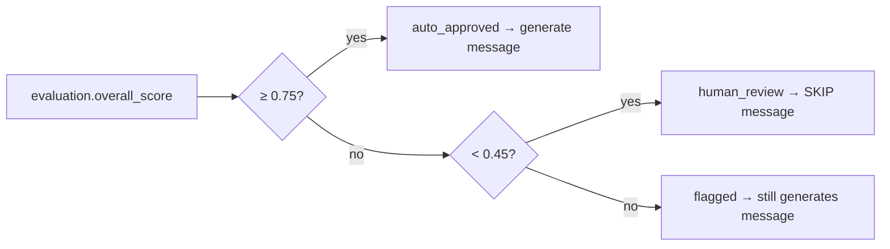

### 8.4 Prompt system — `application/prompts/`

| File | Responsibility |
|---|---|
| `registry.py` | Loads every `templates/*.yaml` at first use, keyed by `(name, version)`; `"latest"` = lexicographically highest version; `render()` validates that all declared variables were supplied (raises `PromptError`); process-wide singleton via `get_prompt_registry()` |
| `schemas.py` | Pydantic schemas describing the expected JSON output shape of each prompt |
| `templates/company_intelligence_v1.yaml` | 6 variables (incl. `evidence_summary`); JSON-only output contract |
| `templates/decision_v1.yaml` | 8 variables; enumerated `qualification` / `action` values |
| `templates/messaging_v1.yaml` | 7 variables; email + LinkedIn + follow-up in one JSON |

### 8.5 `services/llm_provider.py` — the LLM boundary

- `is_llm_available()` — true iff `GROQ_API_KEY` is set **and** ≠ `"local_test_mode"`.
- `LLM_MODEL` default **`llama-3.3-70b-versatile`** (ChatGroq).
- `get_llm()` returns `None` instead of raising when unavailable.
- `_invoke_chain_with_retry` — fresh tenacity `Retrying` per call:
  `stop_after_attempt(2)`, `wait_random_exponential(multiplier=1.0, max=4.0)`.
- `safe_invoke_json` — invokes, extracts JSON with regex `\{.*\}` (DOTALL), returns
  `(payload_or_None, retry_count)`; **never raises** — the calling agent falls back.

---

## 9. Application Support Modules

### 9.1 `context/context_builder.py`

Builds the `LeadContext` an agent sees: the Lead row + its Organization + **memory**
(previous company analysis, last 5 decisions, last 5 outreach messages from
`ai_decision_logs`) + `crm_history` (an empty extension point). `sender_org` =
organization name, else env `SENDER_ORG`, default `"Our Company"`.
`analysis_text(max_chars=4000)` renders the flattened prompt-ready text.

### 9.2 `state/lead_state.py`

`LeadState` — a `TypedDict(total=False)` carried through the graph: `pipeline_id`,
`lead_id`, `organization_id`, `ai_features_enabled`, `lead_snapshot`, `scraping_result`,
`scraped_data`, `enrichment_result`, `enriched_data`, `context`, `company_intelligence`,
`score_result`, `decision`, `evaluation`, `review`, `message`, `stage_timings_ms`,
`errors`, `status`. Also `DecisionContext` (defaults: score `0.0`, label `"Low Priority"`).

### 9.3 `dto/models.py`

Typed boundaries between stages: `PipelineStatus` (SUCCESS / PARTIAL_SUCCESS / FAILED),
`Explanation` (reasoning / evidence / confidence 0–1), `CompanyIntelligenceOutput`,
`DecisionOutput` (defaults `"Unqualified"` / `"review"`), `EvaluationReport` (5 scores +
notes), `ReviewOutput` (default `"human_review"`), `MessagingOutput`, `PipelineResult`,
plus 3 metrics-summary DTOs. All LLM-produced DTOs carry `prompt_name`, `prompt_version`,
`retry_count` for auditability.

### 9.4 `evaluation/evaluators.py` — deterministic confidence scoring

- **completeness** = populated expected fields / expected fields.
- **grounding** — a claim is grounded if ≥ 50% of its > 3-char words appear in the source
  text; no evidence → `0.5`; no source text → `0.0`.
- **consistency** — `1.0` / `0.4` / `0.5` depending on decision-vs-score agreement.
- **overall = 0.4·confidence + 0.2·completeness + 0.2·grounding + 0.2·consistency**.
- Notes appended when completeness < 0.5, grounding < 0.4, or consistency < 0.5.

### 9.5 Remaining support files

| File | Responsibility |
|---|---|
| `explainability/explainer.py` | `deterministic_explanation` (fixed confidence **0.85**) and `explanation_from_llm_payload` (default confidence 0.5) — builds the `Explanation` DTO attached to every agent output |
| `memory/interfaces.py` | `BusinessMemory` ABC: `get_previous_company_analysis`, `get_previous_decisions(5)`, `get_previous_outreach(5)`, `store` |
| `memory/db_memory.py` | `SQLBusinessMemory` — implements the ABC over the `ai_decision_logs` table; `store` never raises (best-effort audit trail) |
| `interfaces/ports.py` | 6 `runtime_checkable` Protocols: Scraper / Enricher / Scorer / Messenger / LLMClient / BusinessMemory ports — the contract the application layer expects from infrastructure |
| `services/infra_adapters.py` | **The single bridge application → core**: `scrape_lead` (TieredScraper async ctx), `enrich_lead` (WaterfallEnricher), `score_lead` (LeadScoringService, forwards `CompanyIntelligenceOutput`), `generate_template_message` (Messenger; prefers `lead.organization` name), `check_ai_features_enabled` (SubscriptionService), plus DB query helpers |
| `exceptions/errors.py` | `ApplicationError` base → `AgentExecutionError(agent_name)`, `PromptError`, `LLMUnavailableError`, `WorkflowStageError(stage)`, `ContextBuildError` |
| `utils/retry.py` | `with_retry` decorator — defaults: 2 attempts, exponential wait min 1.0 / max 6.0 |
| `utils/stage_logger.py` | `StageTimer` + `stage_span` context manager emitting `stage_start` / `stage_complete` / `stage_failed` structured events; re-raises (catching is `_run_stage`'s job) |
| `dependencies.py` | `get_lead_pipeline(db)` DI provider — **gap: currently unused by any endpoint** (endpoints call `run_lead_pipeline` directly) |

---

## 10. Core Domain — `core/domain/`

### 10.1 Models — `core/domain/models/` (SQLAlchemy)

| File / Model | Table | Key columns & defaults |
|---|---|---|
| `user.py` — `User` | `users` | `email` unique, `hashed_password`, `is_active=True`, nullable FK `organization_id` |
| `organization.py` — `Organization` | `organizations` | `plan_tier="free"`, `max_users=1`, `max_leads=100`, `usage_count=0`, Stripe customer/subscription ids, `subscription` relationship (`uselist=False`) |
| `lead.py` — `Lead` | `leads` | `website` required; `score=0.0`; `qualification_label="Low Priority"`; 3 confidence columns `=0.0` (scrape/enrichment/overall); 3 source columns `="none"`; outreach fields; `is_active` soft delete. **No `LeadStatus` enum exists** |
| `lead.py` — `LeadEnrichmentLog`, `ScrapingLog` | per-stage logs | raw results + confidence + method per attempt |
| `lead.py` — `AIDecisionLog` | `ai_decision_logs` | indexed `stage` ∈ {company_intelligence, decision, review, messaging, evaluation}; **one additive table serving three consumers**: explainability audit, `SQLBusinessMemory`, evaluation history |
| `subscription.py` — `Plan` | `plans` | `name` unique (free/pro/enterprise), `max_leads_per_day`, `can_export=False`, `can_use_ai=False` |
| `subscription.py` — `Subscription` | `subscriptions` | `stripe_subscription_id` unique, `plan_name`, `status="active"` (canceled / past_due / unpaid), `cancel_at_period_end` |
| `billing.py` — `UsageRecord`, `Invoice` | usage + invoices | metering & invoice mirrors |
| `api_key.py` — `APIKey` | `api_keys` | `generate_key()` = `"lb_" + token_urlsafe(32)`; stores hash + **8-char prefix**; `rate_limit=100` rpm |

### 10.2 Schemas — `core/domain/schemas/` (Pydantic)

Request/response contracts per resource (`user.py`, `lead.py`, `organization.py`,
`subscription.py`, `api_key.py`). Notable:

- `LeadUpdate` **explicitly** includes `score`, `qualification_label`, scrape/enrichment
  confidence + source, `revenue_band`, `founded_year` — these were previously dropped
  silently by Pydantic v2 `extra="ignore"` (documented fix).
- **Gap:** `subscription.py` schema uses `plan_id` / `is_active`, which mismatches the
  ORM (`plan_name` / `status`).

### 10.3 `services/scoring.py` — `LeadScoringService`

Deterministic weighted scoring; weights must sum to 1.0 (±0.01) or init raises.

| Criterion | Weight | Threshold | Max pts | Rule |
|---|---|---|---|---|
| industry_match | 0.25 | 0.5 | 25 | `max × icp_alignment_score` from CompanyIntelligence; **0 if no intelligence** |
| company_size | 0.20 | 0.5 | 20 | preferred bands `["11-50", "51-200", "201-500"]`; 1 band away → 0.5×; ≥2 away or unknown → 0 |
| email_quality | 0.15 | 0.6 | 15 | confidence-scaled when ≥ 0.6; phone-only → 0.5 × max |
| scrape_quality | 0.15 | 0.6 | 15 | from scrape_confidence |
| enrichment_quality | 0.15 | 0.6 | 15 | from enrichment_confidence |
| linkedin_presence | 0.10 | 0.5 | 10 | LinkedIn URL present |

Classification: **≥ 80 Hot Lead, ≥ 60 Warm Lead, ≥ 40 Cold Lead, else Disqualified**;
total capped at 100. `ScoringModelType` enum has unused variants; per-organization
scoring-config methods are stubs.

---

## 11. Core Infrastructure — `core/infrastructure/`

### 11.1 `auth/security.py`

- Password hashing: **bcrypt** via passlib (72-byte limit) with a `pbkdf2_hmac`-SHA256
  100 000-iteration fallback (format `"pbkdf2_$salt$hash"`).
- JWT: `SECRET_KEY` env (insecure default caught by config validation), HS256,
  **access 30 min**, **refresh 7 days**; tokens carry `exp` + `type`.
- `get_current_user`: HTTPBearer → `verify_token` (type must be `access`, `sub` present)
  → `crud.get_user` → 401 on any failure. `get_current_active_user` additionally requires
  `is_active`.
- **Gap:** `verify_api_key` looks up by 8-char prefix only — full-hash verification is
  explicitly left as a stub.

### 11.2 `billing/subscription_service.py` — plan gating

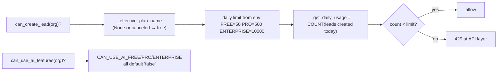

- Env limits: `FREE_MAX_LEADS_PER_DAY=50`, `PRO…=500`, `ENTERPRISE…=10000`;
  `CAN_USE_AI_*` and `CAN_EXPORT_*` all default `"false"`.
- `initialize_plans` seeds the 3 Plan rows at startup (idempotent).
- `assign_plan` creates a synthetic Stripe id `sub_{org}_{plan}_{ts}` (no real payment).
- `cancel`: immediate → status `canceled`, else `cancel_at_period_end=True`.
- **No prices are defined anywhere in the codebase.**

### 11.3 `billing/stripe_service.py`

Real Stripe SDK calls exist (Customer/Subscription CRUD, billing portal,
`Webhook.construct_event` for 5 event types) but: payment succeeded/failed handlers are
`pass`, metered usage is commented out, the plan map is a placeholder
(`price_123→starter, price_456→pro, price_789→enterprise`), and **no webhook route is
registered in `main.py`**. Exposed as global singleton `stripe_service`. The billing
upgrade endpoint returns **402 "Online payments coming soon."**

### 11.4 `database/` — engine + CRUD

- `__init__.py`: `DATABASE_URL` **required** (raises if missing); production forces
  PostgreSQL. Pool: `pre_ping`, size **20**, overflow **40**, recycle **3600 s**, timeout
  **30 s**; `connect_timeout=10s`, `statement_timeout=30000ms`. `SessionLocal` with
  `expire_on_commit=False`. `init_db` = `Base.metadata.create_all` — **no Alembic
  migrations**. `get_db` yields a per-request session with rollback-on-error.
- `crud.py`: the only place raw queries live — User/Organization/Lead/APIKey/
  Subscription/Usage CRUD, `create_ai_decision_log`, `get_lead_by_url` (discovery dedup),
  scraping/enrichment log writers.

### 11.5 `enrichment/enricher.py` — `WaterfallEnricher`

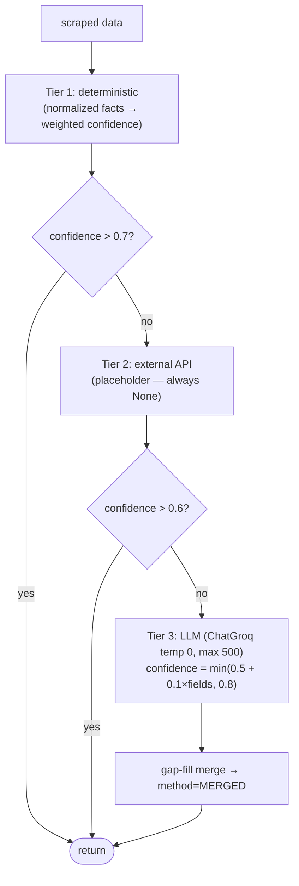

Tier-1 fact weights: organization_type 0.30, founded_year 0.15, employee_count 0.15,
operating_regions 0.10, offerings 0.10, primary_contact 0.15, contact_name 0.10,
contact_title 0.05; aggregate = weighted × (0.7 + 0.3 × min(1, parts/6)), capped **0.9**.
Employee bands `1-10 / 11-50 / 51-200 / 201-500 / 500+`; revenue `$0-1M … $100M+`.
Contact-email priority: general > contact > sales > support > press > careers > privacy >
billing.

### 11.6 `scraping/scraper.py` — `TieredScraper` (2664 lines)

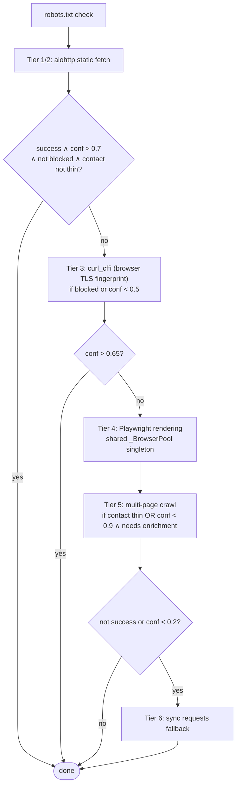

`TieredScraper(timeout=25, max_retries=2)`; honors `Retry-After` ≤ 10 s; backoff
`min(1.5 × 2^attempt, 8)` + jitter; rotates 6 User-Agents;
`_MAX_LOCATIONS_PER_BLOCK = 25`; `ScrapingMethod` enum records which tier won;
`close_scraper_resources()` (called at shutdown) closes the Playwright pool + the
singleton aiohttp session. Parsed output feeds `normalization/normalizer.py`.

### 11.7 Remaining infrastructure files

| File | Responsibility |
|---|---|
| `normalization/normalizer.py` | `normalize_scraped_fields(raw)` — brand/legal name split, organization_type classification (generic 0.4 vs specific 0.9 confidence), email de-obfuscation, E.164 phone formatting, block-grouped addresses, social-link filtering, technology extraction, `text_excerpt` capped 5000 chars. **Additive only** — never removes scraped data |
| `messaging/messenger.py` | Outreach **generation only — nothing is ever sent**. Needs ≥ 2 of 5 data points (company_name, industry, about > 50 chars, contact_name, employees) to use the LLM (temp 0.3, max_tokens 200, data-locked prompt); otherwise template fallback (industry-specific: software/consulting/ecommerce; generic; website-only). `MessageStyle`: professional / friendly / short |
| `logging/__init__.py` | python-json-logger to stdout, `LOG_LEVEL` default INFO; helpers `get_logger`, `log_api_call`, `log_scraping_attempt`, `log_enrichment_attempt`. Request-id correlation lives in `main.py` middleware |
| `workers/orchestrator.py` | Celery app `"leadboost_orchestrator"` (broker/backend default `redis://localhost:6379/0`), task `process_lead_task` (max_retries 3, delay 60 s) — **dormant: zero imports from `application/` or `api/`**; the pipeline runs in-process via BackgroundTasks instead |

---

## 12. Observability — metrics, logging, analytics

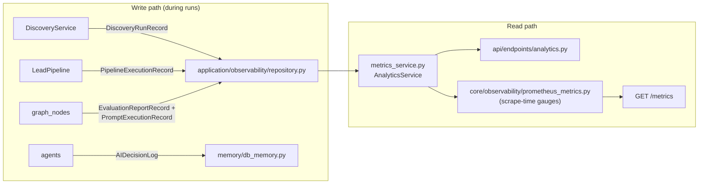

### 12.1 `application/observability/`

| File | Responsibility |
|---|---|
| `models.py` | 4 SQLAlchemy tables: `pipeline_execution_logs` (`pipeline_id` unique, final_status, stage_count, error_count), `evaluation_report_logs` (5 float scores + prompt_version), `prompt_execution_logs` (**written only when source == "llm"**), `discovery_run_logs` (funnel counters per run) |
| `repository.py` | Best-effort writers for the 4 record types (never break the main flow) |
| `metrics_service.py` | `AnalyticsService`: pipeline success rate = SUCCESS-only/total; p95 via `statistics.quantiles(n=100, method="inclusive")[94]`; discovery success = validated/returned; website-resolution rate = resolved_via_fallback/missing_website |

### 12.2 `core/observability/prometheus_metrics.py`

Own private `REGISTRY` (not the global default). Metrics:

| Metric | Type | Labels |
|---|---|---|
| `http_requests_total` | Counter | method, path (route template), status_code |
| `http_request_duration_seconds` | Histogram | method, path |
| `auth_attempts_total` | Counter | result |
| `discovery_runs_total`, `discovery_success_rate_pct`, `discovery_duration_seconds_avg`, `website_resolution_rate_pct`, `pipeline_runs_total`, `pipeline_success_rate_pct`, `pipeline_duration_seconds_avg`, `organizations_total`, `leads_total` | **Gauges refreshed at scrape time** | — |

`route_template` maps concrete URLs to their route pattern to bound label cardinality.
`refresh_periodic_gauges(db, 24h)` runs on every `/metrics` scrape via `render_latest`,
which **swallows refresh failures** so metrics stay available.

---

## 13. Database Schema (ER Diagram)

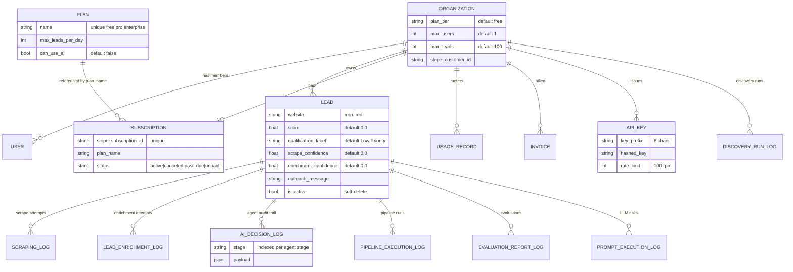

Schema management is `Base.metadata.create_all` at startup — additive only, **no
Alembic**.

---

## 14. Full Per-File Responsibility Table

Every analyzed file in `backend/` (excluding `scripts/` and `tests/`) in one place.

### Root & gateway

| File | Responsibility |
|---|---|
| `main.py` | FastAPI app, lifespan (env validation → init_db ×5 retries → plan seeding; shutdown → scraper cleanup), middleware (request-id/timing, security headers, CORS), health probes, `/metrics`, router registration under `/api/v2` |
| `core/config.py` | `validate_startup_environment()` — fail-fast production checks, warn-only for optional API keys |

### `api/endpoints/`

| File | Responsibility |
|---|---|
| `auth.py` | Register (atomic org+user+default plan), login (JWT pair), refresh, `/me` profile |
| `leads.py` | Lead CRUD + batch create + `POST /{id}/process`; daily-limit enforcement (429); pipeline fan-out via BackgroundTasks |
| `discovery.py` | `POST /discovery/search` — the natural-language entry to `DiscoveryService`; `QueryParseError`→422, other discovery errors→502 |
| `billing.py` | Usage summary, plan list, upgrade (**402 stub**), cancel |
| `analytics.py` | Pipeline / evaluation / discovery metric summaries via `AnalyticsService` |
| `organizations.py` | Organization CRUD with tenant isolation |

### `application/`

| File | Responsibility |
|---|---|
| `discovery/*` (13 files + 6 providers) | See §7 table — parser, providers, resolver, validator, dedup, ranking, service |
| `workflows/lead_pipeline.py` | LangGraph graph assembly + `execute` + status semantics + `run_lead_pipeline` entry |
| `workflows/graph_nodes.py` | 10 node implementations + `_run_stage` graceful degradation |
| `agents/base.py` | Shared agent machinery (LLM invocation pattern, explanation attachment) |
| `agents/company_intelligence_agent.py` | Industry/tech/ICP analysis; technology grounding filter; heuristic fallback |
| `agents/decision_agent.py` | Qualification→action mapping; conservative LLM reconciliation |
| `agents/messaging_agent.py` | Email + LinkedIn + follow-up generation; template fallback |
| `agents/review_agent.py` | Threshold-only gating (0.75 / 0.45), zero LLM |
| `prompts/registry.py` + `schemas.py` + 3 YAML templates | Versioned prompt store + output schemas |
| `context/context_builder.py` | LeadContext assembly (lead + org + memory + crm stub) |
| `state/lead_state.py` | `LeadState` TypedDict + `DecisionContext` |
| `dto/models.py` | All typed stage-boundary DTOs + `PipelineStatus` |
| `evaluation/evaluators.py` | Deterministic completeness/grounding/consistency/overall scoring |
| `explainability/explainer.py` | `Explanation` DTO builders (deterministic 0.85 / LLM payload) |
| `memory/interfaces.py` + `db_memory.py` | BusinessMemory ABC + SQL implementation over `ai_decision_logs` |
| `interfaces/ports.py` | 6 infrastructure Protocols |
| `services/infra_adapters.py` | The application→core bridge (scrape/enrich/score/message/gating) |
| `services/llm_provider.py` | ChatGroq factory, availability check, `safe_invoke_json` |
| `observability/models.py` + `repository.py` + `metrics_service.py` | 4 run-record tables, best-effort writers, `AnalyticsService` aggregations |
| `exceptions/errors.py` | Application exception hierarchy |
| `utils/retry.py` + `stage_logger.py` | Retry decorator; stage timing/logging span |
| `dependencies.py` | Unused `get_lead_pipeline` DI provider (gap) |

### `core/`

| File | Responsibility |
|---|---|
| `domain/models/*` (6 files) | SQLAlchemy tables: users, organizations, leads (+3 log tables), plans, subscriptions, usage/invoices, api_keys |
| `domain/schemas/*` (5 files) | Pydantic request/response contracts |
| `domain/services/scoring.py` | Deterministic weighted lead scoring + Hot/Warm/Cold/Disqualified classification |
| `infrastructure/auth/security.py` | bcrypt+pbkdf2 hashing, JWT issue/verify, `get_current_user` chain, api-key stub |
| `infrastructure/billing/subscription_service.py` | Plan gating (daily limits, AI/export flags), plan seeding, assign/cancel |
| `infrastructure/billing/stripe_service.py` | Stripe SDK wrapper — partially wired (see §16) |
| `infrastructure/database/__init__.py` | Engine, pool, `SessionLocal`, `init_db`, `get_db` |
| `infrastructure/database/crud.py` | All raw ORM queries (single query surface) |
| `infrastructure/enrichment/enricher.py` | 3-tier WaterfallEnricher |
| `infrastructure/scraping/scraper.py` | 6-tier TieredScraper + browser pool + resource cleanup |
| `infrastructure/normalization/normalizer.py` | Scraped-field normalization (additive) |
| `infrastructure/messaging/messenger.py` | Outreach text generation (LLM/template), never sends |
| `infrastructure/logging/__init__.py` | JSON structured logging setup + helpers |
| `infrastructure/workers/orchestrator.py` | Dormant Celery app |
| `observability/prometheus_metrics.py` | Prometheus registry, counters/histogram, scrape-time gauges |

---

## 15. Inter-File Dependency Map

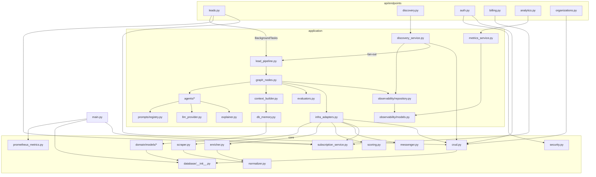

Key invariants (verified in code):

- **`api` never imports `core.infrastructure` scraping/enrichment directly** — only
  through `application`.
- **`application` reaches infrastructure only via `services/infra_adapters.py`**
  (plus `crud.py` for reads/writes).
- **`core` never imports `application` or `api`** — dependency direction is one-way.
- The LLM boundary is concentrated in `llm_provider.py` (+ enricher Tier 3 and
  messenger, which construct ChatGroq themselves).

---

## 16. Known Gaps & Intentional Stubs

All verified in code — useful when extending the system:

| # | Gap / stub | Location |
|---|---|---|
| 1 | `get_lead_pipeline` DI provider exists but no endpoint uses it (endpoints call `run_lead_pipeline` directly) | `application/dependencies.py` |
| 2 | Billing upgrade returns **402 "Online payments coming soon."** — no real payment flow; no prices defined anywhere | `api/endpoints/billing.py` |
| 3 | Stripe webhook handlers for payment succeeded/failed are `pass`; metered usage commented out; placeholder price→plan map; **no webhook route registered** | `core/infrastructure/billing/stripe_service.py`, `main.py` |
| 4 | `verify_api_key` matches by 8-char prefix only — full-hash verification is an explicit TODO | `core/infrastructure/auth/security.py` |
| 5 | Subscription Pydantic schema (`plan_id`, `is_active`) mismatches the ORM (`plan_name`, `status`) | `core/domain/schemas/subscription.py` |
| 6 | Celery orchestrator is dormant — zero imports; pipeline runs in-process via BackgroundTasks | `core/infrastructure/workers/orchestrator.py` |
| 7 | Enrichment Tier 2 (external API) is a placeholder that always returns `None` | `core/infrastructure/enrichment/enricher.py` |
| 8 | `brave_provider.py` exists but is superseded by Overpass + Serper in the active discovery flow | `application/discovery/providers/brave_provider.py` |
| 9 | No Alembic migrations — schema managed by `create_all` (additive only) | `core/infrastructure/database/__init__.py` |
| 10 | `crm_history` in LeadContext is an always-empty extension point | `application/context/context_builder.py` |
| 11 | Per-organization scoring configuration methods are stubs; `ScoringModelType` has unused variants | `core/domain/services/scoring.py` |
| 12 | Messenger only generates outreach text — no email/LinkedIn sending exists anywhere | `core/infrastructure/messaging/messenger.py` |
| 13 | `CAN_USE_AI_*` defaults are all `"false"` — AI enrich/messaging stages are skipped unless env explicitly enables them | `core/infrastructure/billing/subscription_service.py` |

---

*Generated from direct source analysis. Companion docs: `ARCHITECTURE.md`,
`DISCOVERY.md`, `MONITORING.md`, `ENVIRONMENT.md` in this folder.*

